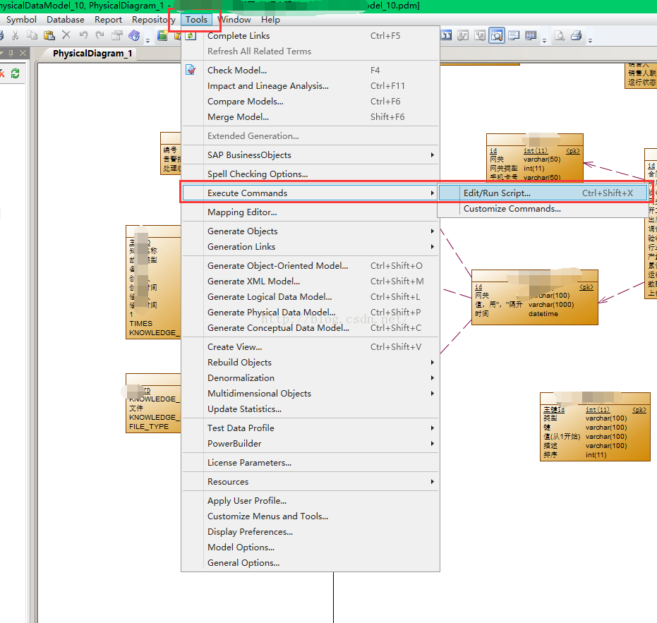
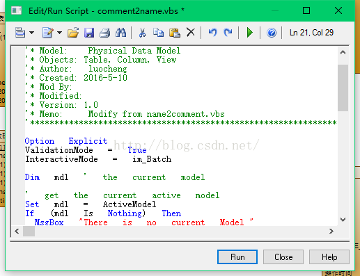

这里需要两个vbs，

一个是name2comment.vbs，是把name的值给comment，网上找的

一个是comment2name.vbs，是把comment的值给name，反向工程时用到的，网上没找到，便自己动手，丰衣足食，自己改写了一个

### 使用方法如下

打开要替换的工程，点击tools->execute commands->edit/run script

在工具栏中找到那个文件夹图标的按钮，点开，找到将要运行的vbs文件，再点击run即可，图片如下

name2comment.vbs 对应文件

comment2name.vbs 对应文件

